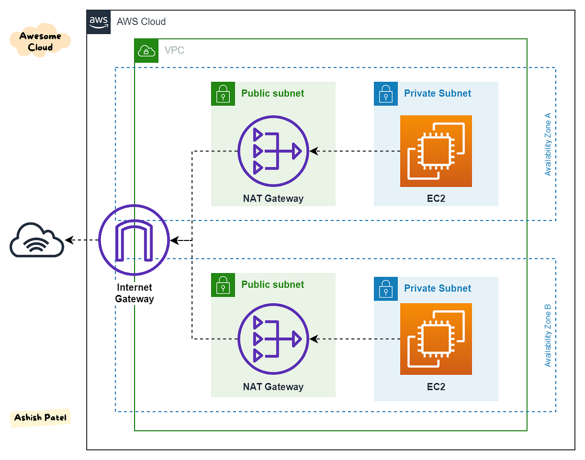

# basic-Infra-terraform-AWS
Infraestructura Básica con Terraform + AWS

Objetivo: Montar desde cero una VPC en AWS, con subnets públicas/privadas, Internet Gateway, NAT Gateway y EC2.

Skills: Terraform (módulos, workspaces), AWS VPC, IAM, tagging, cost‑management básico.
Entregables:
Código Terraform reutilizable (módulo “network”).
Documentación de variables y outputs.
Reporte de optimización de costos (AWS Cost Explorer).

